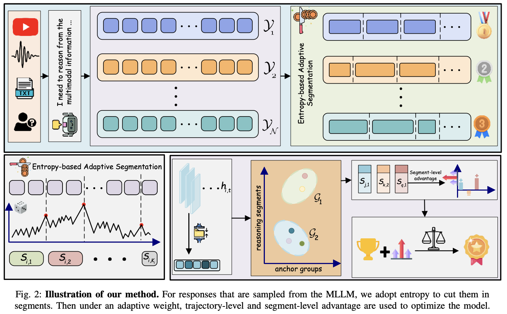
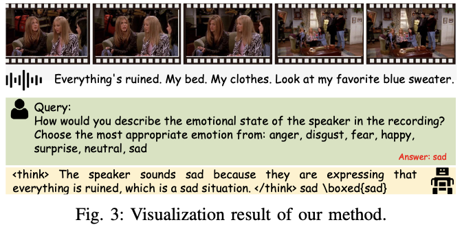
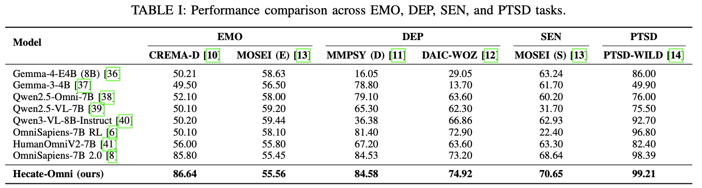
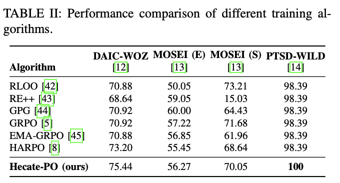

# Hecate-Omni: Reinforcement Learning with Hierarchical Credit Assignment for Multimodal Social Behavior Reasoning
<p align="center">
  <a href="https://huggingface.co/datasets/Harry-1234/Hecate-Omni" target="_blank">
</p>
    
## 👀 Hecate-Omni Overview
<p align="center">
    
</p>

<p align="center">
    
</p>

Socially intelligent AI systems require multimodal reasoning to understand human emotions, mental states, and behaviors. However, existing reinforcement learning approaches based on group relative policy optimization assign a shared trajectory-level advantage to all response tokens, overlooking the different contributions of local reasoning decisions. This coarse credit assignment limits the ability to distinguish critical reasoning transitions from routine continuations. To address this limitation, we introduce Hecate-Omni, a multimodal social reasoning model trained with Hecate-PO, a state-aligned hierarchical policy optimization method. The core insight is to align credit assignment and policy updates with the latent structure of reasoning. Specifically, Hecate-PO partitions responses into entropy-guided reasoning segments and organizes segments with similar internal reasoning states into anchor groups, enabling state-conditioned local advantage estimation without additional process supervision. It then adaptively combines segment-level and trajectory-level advantages according to segment uncertainty, preserving global outcome guidance while differentiating local contributions. Segment-level importance ratios further align policy correction with the granularity of credit assignment. Experiments demonstrate that Hecate-Omni outperforms several baselines across all six evaluated dataset–task settings spanning emotion recognition, depression detection, sentiment analysis, and post-traumatic stress disorder detection. Ablation studies support the effectiveness of state-aligned anchor grouping, segment-level policy correction, and adaptive advantage fusion. Training analyses further reveal sustained differentiation between local and trajectory-level credit, providing empirical support for the proposed hierarchical optimization mechanism. 

#### 🌟 Contributions in Hecate-Omni

1. We develop and release **Hecate-Omni**, a model for multimodal social intelligence reasoning, designed to handle diverse social behavior tasks spanning emotion recognition, mental-state analysis, sentiment understanding, and pathological behavior recognition. Hecate-Omni achieves SOTA on the evaluated benchmarks, demonstrating effective and robust reasoning across different social behavior scenarios.

2. We introduce **Hecate-PO**. Hecate-PO adaptively identifies latent reasoning units using predictive entropy and establishes correspondences among equivalent reasoning states through internal state representations, enabling reasoning decisions to be evaluated under semantically comparable contexts.

## 📈 Experimental Results

#### 📍 Results
<p align="center">
    
</p>

<p align="center">
    
</p>

## ⭐ Training detail and evaluation

### 🔮 Evaluation
```
MODEL_PATH=/path/to/base_model \
DATA_PATH=/path/to/human_behavior_atlas \
ADAPTER=/path/to/checkpoint \
EVAL_SPLIT=test EVAL_PER_DATASET=0 RUN_NAME=hecatepo_test \
bash scripts/run_hecatepo.sh evaluate
```

#### 📖 Prepare
Download the base model [OmniSapiens2.0](https://huggingface.co/HumanBehaviorAtlas/OmniSapiens2.0) and [Qwen2.5-Omni-7B](https://huggingface.co/Qwen/Qwen2.5-Omni-7B) from [huggingface](https://huggingface.co/)

Prepare Hecate-Omni LoRA weights from [huggingface](https://huggingface.co/datasets/Harry-1234/Hecate-Omni)

Prepare human-behavior-atlas data from [huggingface]([https://huggingface.co/datasets/Harry-1234/Hecate-Omni](https://huggingface.co/datasets/HumanBehaviorAtlas/human_behavior_atlas)
### 🔥 Training
```
MODEL_PATH=/path/to/base_model \
DATA_PATH=/path/to/human_behavior_atlas \
RUN_NAME=hecatepo_train \
bash scripts/run_hecatepo.sh train
```
### Examples

https://github.com/user-attachments/assets/000a936d-2834-4798-88f5-3d7d52c58610
```
Question:
How would you describe the emotional state of the speaker in the recording? Choose the most appropriate emotion from:
anger,
disgust,
fear,
happy,
surprise,
neutral,
sad

First reason briefly from the provided evidence. Enclose your reasoning in <think>...</think>. Then provide exactly one final answer in \boxed{...}. For classification, use exactly one of the requested labels. For open questions, give a concise, direct answer.

Hecate-Omni:
<think> The speaker sounds sad because they are expressing that everything is ruined, which is a sad situation. </think> sad \boxed{sad}
```
## 📜 License
Our project is under [MIT License](https://github.com/eeee-sys/Hecate-Omni/blob/main/LICENSE)
